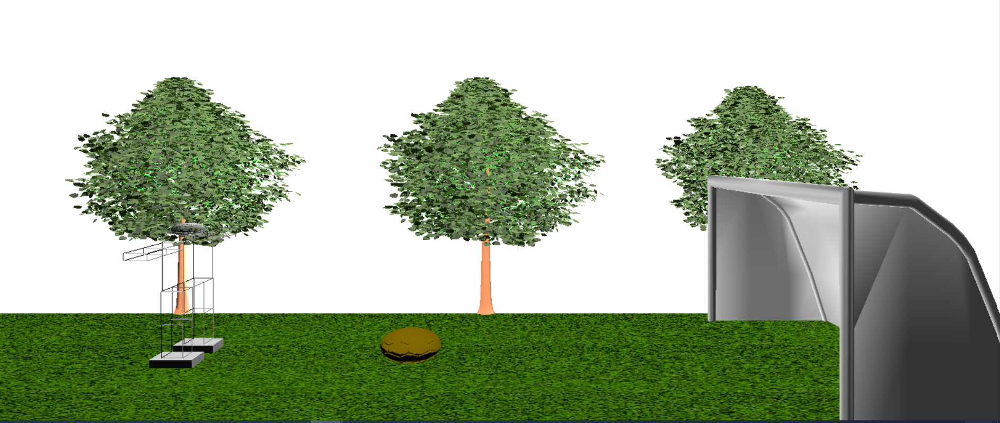
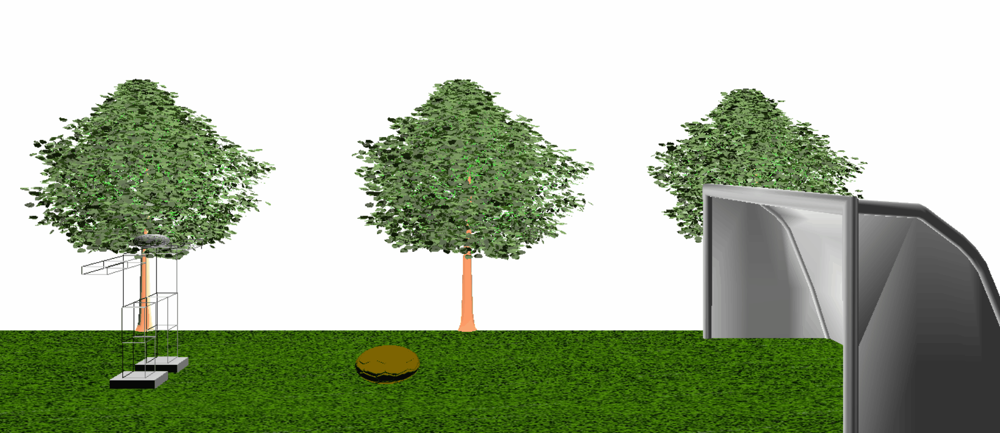
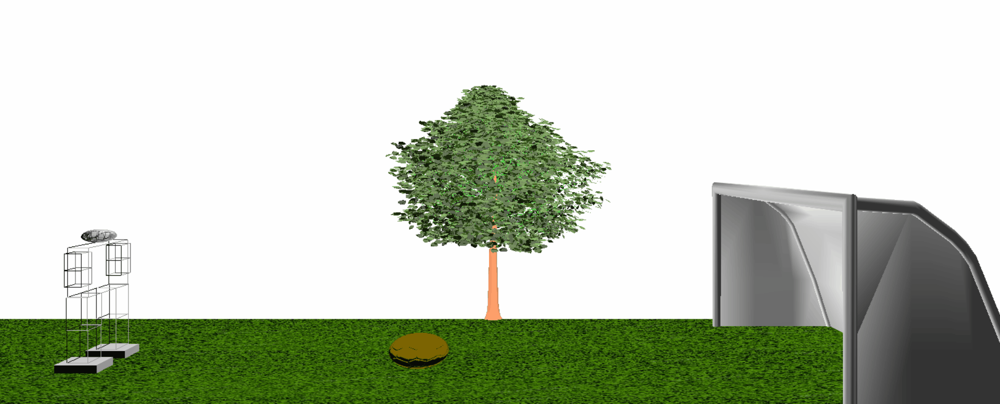

### Texture mapping and Animation using OpenGL
### First of all, A previously drawn report was placed in the scene. I also added a goal , a ball and some trees.
 

### Texture maping

#### Floor texture can be changed using a menu
 

### I also created three animations. 

#### The robot can raise his arm. 

#### Then, walk towards the ball. 

#### Finally, it can kick the ball

### Some shortcuts
  
| Key | Action |
| --- | --- |
| <kbd>S</kbd>  <kbd>s</kbd>  | left shoulder |
| <kbd>N</kbd>  <kbd>n</kbd>  | right shoulder |
| <kbd>B</kbd>  <kbd>b</kbd>  |  left shoulder |
| <kbd>L</kbd>  <kbd>l</kbd>  | right shoulder |
| <kbd>E</kbd>  <kbd>e</kbd>  |  left elbow |
| <kbd>R</kbd>  <kbd>r</kbd>  | right elbow |
| <kbd>Z</kbd>  <kbd>z</kbd>  |  left leg |
| <kbd>X</kbd>  <kbd>x</kbd>  | left legdown |
| <kbd>A</kbd>  <kbd>a</kbd>  | left leg |
| <kbd>C</kbd>  <kbd>c</kbd>  |  right leg |
| <kbd>V</kbd>  <kbd>v</kbd>  | right legdown |
| <kbd>Q</kbd>  <kbd>q</kbd>  | right leg |
|  <kbd>0</kbd> | Reset |
|  <kbd>+</kbd> | zoom in |
| <kbd>-</kbd>  |  zoom out |
|<kbd>&larr;</kbd>| Turn Left |
|  <kbd>&rarr;</kbd>|  Turn Right|  
|  <kbd>&uarr;</kbd> |  Up |
| <kbd>&darr;</kbd>  |  Down |
