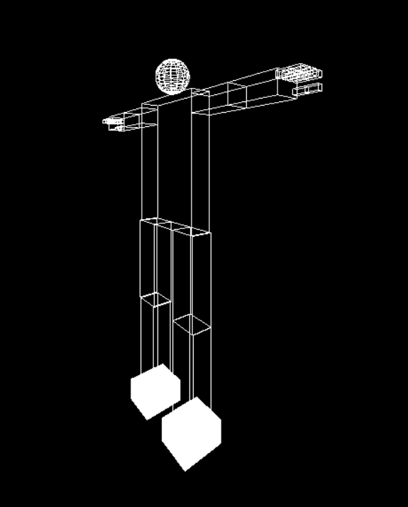

# Full Robot body model and Camera movement
## Using OpenGL a full robot body was created with some joint movement capabilities
### Full Body
 

## Left,right,up and down camera movement are available

### Left-Right camera mvement using &larr; and &rarr; keys

  
   

### Up-Down camera mvement using &uarr; and &darr; keys

  
   

## zoom in and out using +,- keys

  
   

## Joint movements

  
   

